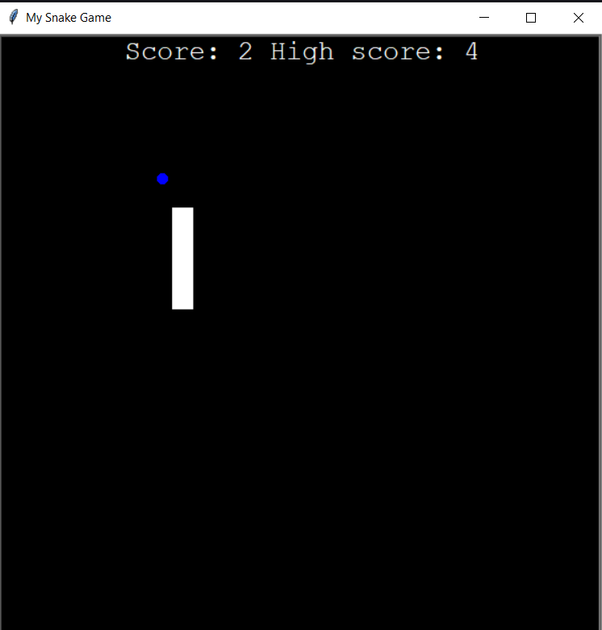

# Snake Game in Python

This is a classic Snake game built with Python using the `turtle` graphics library.
The player controls the snake's movement to collect food, which makes the snake grow longer.
The goal is to avoid colliding with the wall or the snake's own tail.

## Features

- The snake moves continuously and grows longer as it collects food.
- A scoreboard keeps track of the current score and the highest score.
- Collision detection with the wall and snake's own body.
- High score is saved in a file (`data.txt`) to persist between sessions.
- Keyboard control:
    - `W` to move up
    - `S` to move down
    - `A` to move left
    - `D` to move right

## Requirements

- **Python 3.12.2**
- **'turtle'**

